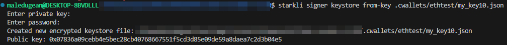
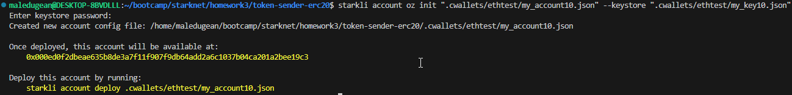
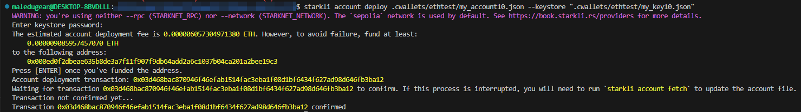
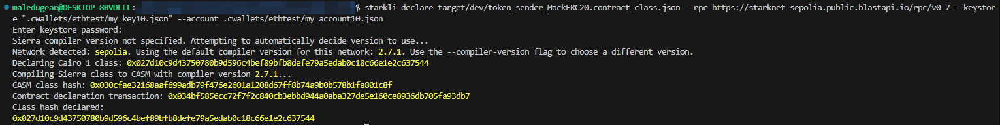
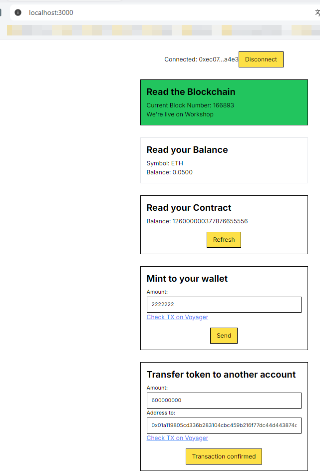

<p align="center">
  <a href="" rel="noopener">
 </a>

</p>

<h3 align="center">USD Magic</h3>

<div align="center">

[]()
[](https://github.com/malledugean/Starknet-token-sender-erc20/issues)
[](https://github.com/malledugean/Starknet-token-sender-erc20/pulls)
[](/LICENSE)

</div>

---

<p align="center"> USD Magic (USDM) - ERC-20 Implementation.
    <br> 
</p>

## 📝 Table of Contents

-   [About](#about)
-   [License](#licensed)
-   [Usage](#usage)
-   [Version](#usage)
-   [Actions](#actions)

## 🧐 About <a name = "about"></a>

This project implements an ERC-20 token named USD Magic (USDM) on the Starknet blockchain using open zepelin libraries.

**Features:**

-   Compliant with the ERC-20 standard for token functionalities.
-   Atention unlimited MINT, Don't buy this token!!!

### Security:

-   Sepolia contract at: 0x0232889b389b9495be13daf615861780c16194a47ceb592b71c62769452e505c
-   Mainnet contract at: 0x01ffaf17ab9bf435c5973b892916465530c7deb98f7f335819fe9d0a083a9670

WARNING: This Tokes is currently under tests at Sepolia at following address.
The official token address will be included here! Only use the oficial references!

## License <a name = "licensed"></a>

This project is licensed under the Apache License (Apache-2.0). See the LICENSE file for details.

## Version <a name = "version base"></a>

-   scarb 2.6.3
-   snforge 0.22.0
-   openzeppelin 0.10.0

## Usage <a name = "usage"></a>

```shell
$ scarb build
$ snforge test
```

## Actions log<a name = "action"></a>

-   1 - Key file preparation
-   

-   2 - Account preparation
-   

-   3 - Deploy Account
-   

-   4 - Declare your contract
-   

-   5 - Deploy your contract
-   

-   6 - Contract tests by interface web
-   

-   7 - Added Read Total Supply tests by interface web
-   .png>)
